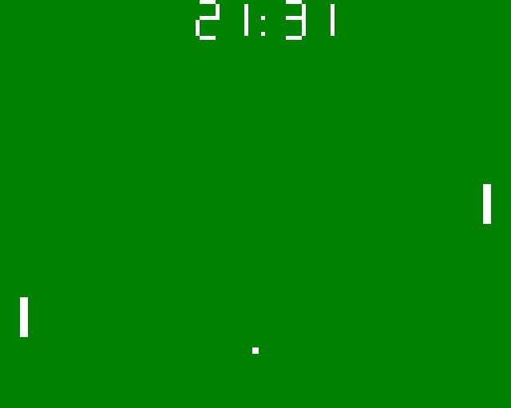
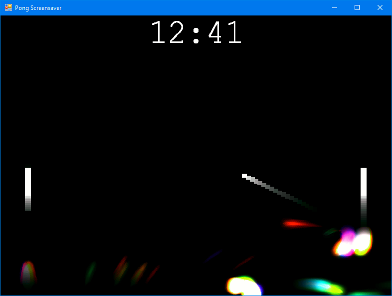

# Pong Screensaver
A Windows screensaver in the appearance of Pong, the score shown is current time.
As hours and minutes tick, the corresponding bat will miss the ball.

It's written in C# and probably requires Visual Studio to compile. It looks like
it was once upgraded to VS2010.

Found on an old disk. I am guessing I wrote it in 2006 or so and it's put on Github as-was.

MIT license.

# Screenshots
### Mode 1, classic

### Mode 2, wild

# Video

